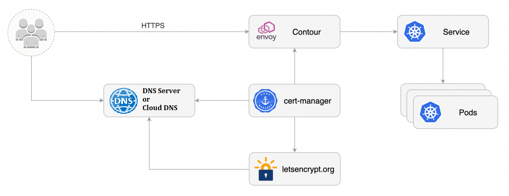

# cluster-requirements

These files contain the configuration of our cluster (kind), Load balancer(contour), cert-manager, ingress and service which are automated by ansible in the ansible-deploy playbook.Also there is a script "check-pods-certificate.sh" which will append to the crontab in order to renew the certificate of our program in a timely manner.

Since I hadn't a suitable cloud production and I just have a vps with 1 core cpu and 2 gb ram, minikube was not suitbale, because it requires 2 core cpu at minimum.So I had to choose kind. 

it is better to implement cluster and related service with terraform and helm package manager, however due to the limitation in time, I prefer to use ansible.

There are several load balancers such as: haproxy, nginx, contour and ..etc. and I prefer haproxy, because it works in two layers and the performance is suitable even in the peak traffic.but in this scenario I implemented contour, because of my low foot print, also it's better for kind cluster.

Anyway, ingress controller consists of a Pod that watches the Kubernetes Control Plane for new and updated Ingress Resource objects and An Ingress Resource is essentially a list of traffic routing rules for backend Services. for example, routing requests that hit test.slashgeek.ir to the backend Kubernetes Service go-app.

__________________________________________________________________________________________________

# HOW TO

In order to deploy the cluster and related pods, you should insure that docker and kubectl are installed, then just configure your ansible hosts and run:

**ansible-playbook ansible-deploy.yml**

and after several minutes (if you have a one core cpu and limited ram like me !!) your cluster would be ready.

